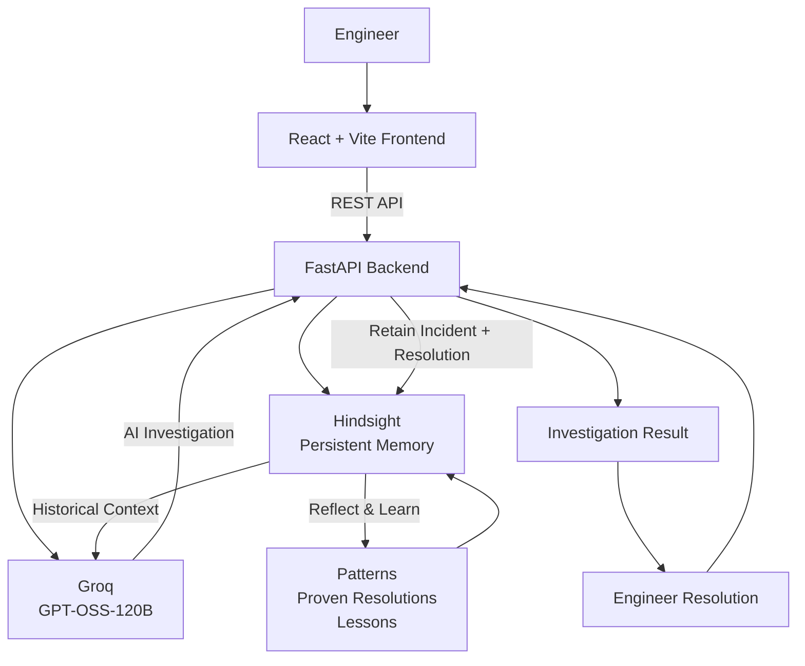

# IncidentMind

### AI-Powered Incident Response with Persistent Memory

**IncidentMind** is an AI-powered incident-response agent that uses **Hindsight** to remember previous incidents, successful resolutions, recurring patterns, and operational lessons.

Built for **HackwithHyderabad 3.0** under the theme:

> **"AI Agents That Learn Using Hindsight."**

---

## 🚀 Overview

Production incidents often repeat, but traditional AI assistants may treat every incident as a new problem.

IncidentMind gives an AI incident-response agent **persistent organizational memory**.

It can:

* Recall similar historical incidents
* Identify previous root causes and resolutions
* Use historical context while investigating a new incident
* Retain successful resolutions
* Reflect over accumulated incident memories
* Surface recurring patterns and lessons for future incidents

### Core Learning Loop

**Recall → Reason → Resolve → Retain → Reflect → Learn**

---

## 🎯 Problem

Production incidents frequently repeat:

* API latency and timeout issues
* Database connection problems
* Recurring infrastructure failures
* Similar root causes across incidents

Engineers should not have to investigate the same type of incident from scratch every time.

---

## 💡 Solution

IncidentMind creates a continuous learning loop:

1. An engineer reports a new incident.
2. Hindsight recalls relevant historical incidents and resolutions.
3. The current incident is combined with historical context.
4. Groq-powered AI investigates the incident.
5. The agent provides likely causes, evidence, diagnostics, and recommended actions.
6. The engineer resolves the incident.
7. The incident and successful resolution are retained in Hindsight.
8. Hindsight reflects over accumulated memories to identify patterns and lessons.
9. Future incidents can recall this knowledge.

---

## 🏗️ Architecture



### System Flow

**Engineer → React → FastAPI → Hindsight Recall → Groq Reasoning → Investigation → Resolution → Hindsight Retain → Hindsight Reflect → Future Learning**

Hindsight is the **central persistent-memory layer**, while Groq provides the AI reasoning layer.

---

## 🧠 How Hindsight Is Used

Hindsight is central to IncidentMind's learning process.

### 1. Recall

When an incident is reported, IncidentMind searches the Hindsight memory bank for relevant previous incidents and resolutions.

**Current incident:**

> Payment API latency increased to 4.8 seconds and database connection timeouts are appearing in the logs.

**Historical context can include:**

* Previous Payment API latency incidents
* Database connection exhaustion
* Previous successful connection-pool changes
* Related operational lessons

---

### 2. Reason

The recalled memories are combined with the current incident and passed to the **Groq-powered AI reasoning layer**.

The agent uses this context to produce:

* Likely root cause
* Historical evidence
* Diagnostic checks
* Immediate mitigation steps
* Validation steps

---

### 3. Retain

After the incident is resolved, the incident and successful resolution are stored back in Hindsight.

**Example resolution:**

> Increased the database connection pool from 20 to 50 connections and adjusted the idle timeout.

This experience becomes available to future investigations.

---

### 4. Reflect

Hindsight reflects over accumulated incident memories to identify:

* Similar incidents
* Recurring root causes
* Previous successful resolutions
* What responders should verify
* Lessons for future incidents

This turns stored incident history into **usable operational knowledge**.

---

## 🔍 Example Incident

### Incident

> Payment API latency increased to 4.8 seconds and database connection timeouts are appearing in the logs.

### Recalled History

IncidentMind recalls previous incidents involving:

* Payment API latency
* Database connection delays
* Connection-pool exhaustion
* Successful database pool configuration changes

### AI Investigation

The agent identifies **database connection-pool exhaustion** as a likely cause and recommends checking:

* Current connection-pool usage
* Database connection count
* Traffic volume
* Connection leaks
* Query performance
* Recent deployments

### Resolution

> Increased the database connection pool from 20 to 50 connections and adjusted the idle timeout.

### Future Learning

The resolution is retained in Hindsight.

When a similar incident occurs in the future, IncidentMind can recall this previous experience and use it as supporting evidence.

---

## 🛠️ Tech Stack

### Frontend

* React
* Vite
* JavaScript
* CSS

### Backend

* Python
* FastAPI
* Uvicorn
* REST APIs

### AI & Memory

* **Hindsight Cloud** — Persistent memory
* **Groq** — AI reasoning
* **openai/gpt-oss-120b** — Reasoning model

### Deployment

* **Vercel** — Frontend
* **Render** — Backend
* **GitHub** — Source control

---

## 📁 Project Structure

```text
IncidentMind/
├── backend/
│   ├── main.py
│   └── requirements.txt
│
├── frontend/
│   ├── src/
│   ├── public/
│   ├── package.json
│   └── ...
│
├── .gitignore
└── README.md
```

> `main` is the Git branch. `backend/` and `frontend/` are folders inside the repository.

---

## 🔌 Backend API

| Endpoint                     | Method | Description                                               |
| ---------------------------- | ------ | --------------------------------------------------------- |
| `/api/health`                | GET    | Checks backend and configuration status                   |
| `/api/incidents/recall`      | POST   | Retrieves relevant historical memories                    |
| `/api/incidents/investigate` | POST   | Investigates an incident using memory and AI reasoning    |
| `/api/incidents/resolve`     | POST   | Retains the incident resolution in Hindsight              |
| `/api/incidents/reflect`     | POST   | Identifies patterns and lessons from accumulated memories |
| `/api/memory`                | GET    | Retrieves memories for the Hindsight dashboard            |

---

## 💻 Local Setup

### 1. Clone the repository

```bash
git clone https://github.com/madhulikadavula/incidentmind.git
cd incidentmind
```

### 2. Backend Setup

```bash
cd backend
python -m venv venv
```

#### Git Bash

```bash
source venv/Scripts/activate
```

#### Windows PowerShell

```powershell
.\venv\Scripts\Activate.ps1
```

Install dependencies:

```bash
pip install -r requirements.txt
```

---

### 3. Environment Variables

Create a `.env` file in the project root:

```env
HINDSIGHT_API_KEY=your_hindsight_api_key
HINDSIGHT_BASE_URL=https://api.hindsight.vectorize.io
HINDSIGHT_BANK_ID=incidentmind
GROQ_API_KEY=your_groq_api_key
FRONTEND_URL=http://localhost:5173
```

**Never commit API keys or other secrets to GitHub.**

---

### 4. Start the Backend

From the project root:

```bash
uvicorn backend.main:app --reload
```

Backend:

```text
http://127.0.0.1:8000
```

API documentation:

```text
http://127.0.0.1:8000/docs
```

---

### 5. Start the Frontend

Open another terminal:

```bash
cd frontend
npm install
```

Create `frontend/.env`:

```env
VITE_API_BASE_URL=http://127.0.0.1:8000
```

Start the frontend:

```bash
npm run dev
```

Frontend:

```text
http://localhost:5173
```

---

## ☁️ Production Deployment

### Frontend — Vercel

Deployed from:

```text
main
└── frontend/
```

Environment variable:

```env
VITE_API_BASE_URL=https://incidentmind-backend.onrender.com
```

### Backend — Render

Deployed from:

```text
main
└── backend/
```

Build command:

```bash
pip install -r backend/requirements.txt
```

Start command:

```bash
uvicorn backend.main:app --host 0.0.0.0 --port $PORT
```

Required environment variables:

```text
HINDSIGHT_API_KEY
HINDSIGHT_BASE_URL
HINDSIGHT_BANK_ID
GROQ_API_KEY
FRONTEND_URL
```

---

## 🎬 Demo Flow

The live demonstration follows the complete learning loop:

```text
Report Incident
       ↓
Hindsight Recall
       ↓
Groq AI Investigation
       ↓
Resolve Incident
       ↓
Retain Resolution
       ↓
Hindsight Memory Dashboard
       ↓
Hindsight Reflection
       ↓
Recurring Patterns & Lessons
```

### Demo Scenario

Use the Payment API incident:

> **Payment API latency increased to 4.8 seconds and database connection timeouts are appearing in the logs.**

The demo shows:

1. A new incident being reported
2. Hindsight recalling related incidents
3. Groq generating an investigation
4. The engineer submitting the resolution
5. The resolution being retained
6. The Hindsight Memory dashboard updating
7. Reflection identifying recurring patterns and previous successful resolutions

---

## ✨ Key Features

* Persistent incident memory
* Historical incident recall
* AI-assisted incident investigation
* Historical evidence during reasoning
* Resolution retention
* Memory reflection
* Recurring root-cause identification
* Proven-resolution tracking
* Incident history
* Hindsight memory dashboard
* Production deployment

---

## 🔄 Why Hindsight Matters

Hindsight is not simply used as a database in IncidentMind.

It provides the agent with **persistent experience** that can be recalled and reused during future investigations.

### Stateless AI

```text
Current Incident
       ↓
     Answer
```

### IncidentMind

```text
Current Incident
       +
Historical Memory
       ↓
Context-Aware Investigation
       ↓
Resolution
       ↓
Persistent Memory
       ↓
Future Investigation
```

This allows IncidentMind to move from a **stateless assistant** toward an agent that can learn from previous incident experiences.

---

## 📊 Project Outcome

During testing, IncidentMind demonstrated the complete memory loop:

* A Payment API incident was investigated.
* Relevant historical incidents were recalled.
* A previous successful resolution was surfaced.
* The new resolution was retained in Hindsight.
* The Hindsight Memory dashboard displayed accumulated memories.
* Reflection identified database connection-pool exhaustion as a recurring pattern.
* The previous successful resolution was surfaced as supporting knowledge.

---

## 🚀 Future Improvements

Possible future enhancements include:

* Integration with monitoring and observability platforms
* Automatic incident ingestion from alerts
* Slack / Microsoft Teams notifications
* Structured incident timelines
* Automatic severity classification
* Service dependency analysis
* Automated post-incident reports
* Advanced incident correlation
* Team-level memory and access controls

---

## 👥 Team

**IncidentMind**

Built for **HackwithHyderabad 3.0**.

---

## 📄 License

This project was created as a hackathon project.
